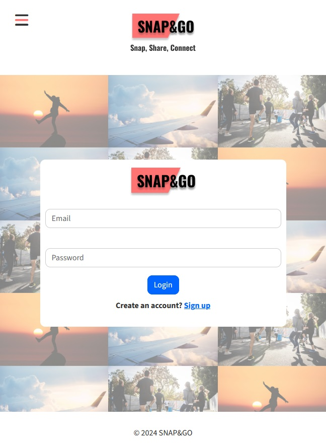

# SNAP&GO: JS2



## Description:

This project is a group work of three students. This project aims to demonstrate skills in JS as part of a school project. The project features a social media platform where a user can post an image and include up to 150 characters of text. The user can view other posts, react to them, comment, and follow other users as they like. Users can register an account with a @noroff.no or stud.noroff.no email address. Because several students are using the API, we made sure only posts with images that were posted on our platform are displayed in the feed, this is because we wanted to have a stronger focus on images in our project. 

### Required Features:
The following user stories are required for a passing submission:

- User with @noroff.no or @stud.noroff.no email can register profile
- Registered user can login
- User can view a post content feed
- User can filter the post content feed
- User can search the post content feed
- User can view a post content item by ID
- User can create a post content item
- User can update a post content item
- User can delete a post content item

### Additional Features:
The following user stories are optional:

- User can create a comment on a post
- User can edit profile media
- User can follow/unfollow a profile
- User can react to a post content item

### Further Features:
As we are three students, we were expected to add extra features, those are:

- User can see number of characters they have put in during post creation
- darkmode
- Notifications when a post receive new likes or comments
- A cool image gallery that reflects up to the 100 latest posts
- Interactive reaction bar

## Planned with:
Completed tasks are located in the archive of the "Done" list!
- [Trello](https://trello.com/invite/b/0DpUwXYt/ATTI7c9c0b156f08118866004db45bbec6ecBF3D54F9/js2-ca)

## Designed with:
- [Figma](https://www.figma.com/)

## Built With:
- [Bootstrap](https://getbootstrap.com/docs/5.3/getting-started/introduction/)
- [SASS/SCSS](https://sass-lang.com/)
- [Javascript](https://developer.mozilla.org/en-US/docs/Web/JavaScript)

## Getting Started:

### Installing

1. Clone the repo:

```bash
git clone git@github.com:jonhenrikaavitsland/snap-and-go.git
```

2. Install the dependencies:

```
npm install
```

### Running

To run the app, run the following commands:

```bash
npm run start
```

## Contributors / Contact

- Jon Henrik Åvitsland 
[Jon's LinkedIn page](https://www.linkedin.com/in/jon-henrik-aavitsland-abaa872b7/)

- Ramona Jensen
[Ramona's LinkedIn page](https://www.linkedin.com/in/ramona-jensen-9994362b8/)

- Henrik Bakke
[Henrik's LinkedIn page](https://www.linkedin.com/in/henrik-bakke-76b716294/)